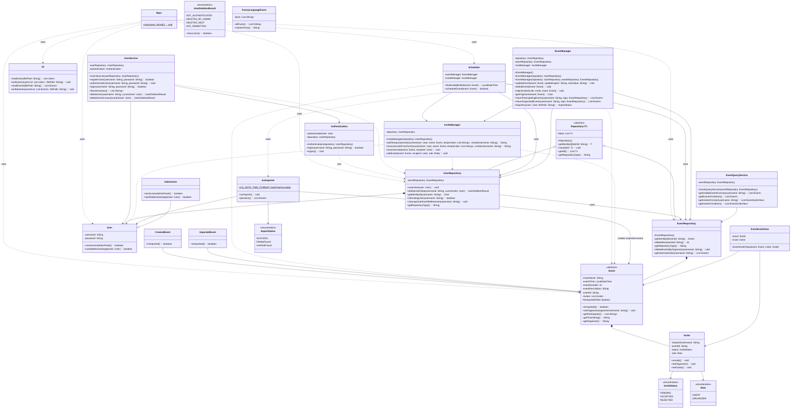

```mermaid
classDiagram
    class Authentication {
        -authenticatedUser: User
        -repository: UserRepository
        +Authentication(repository: UserRepository)
        +login(username: String, password: String) : boolean
        +logout() : void
    }

    class Main {
        +main(args: String[]) : void$
    }

    class UserService {
        -userRepository: UserRepository
		-authentication: Authentication
        +UserService(userRepository: UserRepository)
		+registerUser(username: String, password: String) : boolean
		+authenticateUser(username: String, password: String) : User
		+login(username: String, password: String) : boolean
		+listUsernames() : List~String~
		+deleteUser(username: String, currentUser: User) : UserDeletionResult
		+deleteOwnAccount(currentUser: User) : UserDeletionResult
    }


    class Repository~T~ {
        <<abstract>>
        #data: List~T~
        +Repository()
        +getItemById(itemId: String) : T
        +save(item: T) : void
        +getAll() : List~T~
        +getRepositoryType() : String
    }

    class EventRepository {
        +EventRepository()
        +getItemById(eventId: String) : Event
        +deleteItem(eventId: String) : int
        +getRepositoryType() : String
        +deleteEventsByOrganizer(username: String) : void
        +getUserCalendar(username: String) : List~Event~
    }

    class UserRepository {
        -eventRepository: EventRepository
        +saveUser(user: User) : void
        +deleteUserData(username: String, currentUser: User) : UserDeletionResult
        +getItemById(username: String) : User
        +isExistingUser(username: String) : boolean
        +cleanupUserEventReferences(username: String) : void
        +getRepositoryType() : String
    }

    class IO {
        +readUsers(filePath: String) : List~User~
        +writeUsers(userList: List~User~, filePath: String) : void
        +readEvents(filePath: String) : List~Event~
        +writeEvents(eventList: List~Event~, filePath: String) : void
    }

    class User {
        -username: String
        -password: String
        +canAccessAdminPanel() : boolean
        +canDeleteUser(targetUser: User) : boolean
    }
    
    class AdminUser {
        +canAccessAdminPanel() : boolean
        +canDeleteUser(targetUser: User) : boolean
    }
    

    class Scheduler {
        -eventManager: EventManager
        -inviteManager: InviteManager
        +findAvailableSlot(event: Event) : LocalDateTime
        +scheduleEvent(event: Event) : boolean
    }

    class EventManager {
        -repository: UserRepository
        -eventRepository: EventRepository
        -inviteManager: InviteManager
        +EventManager()
        +EventManager(repository: UserRepository)
        +EventManager(repository: UserRepository, eventRepository: EventRepository)
        +updateEvent(event: Event, updateAspect: String, newValue: String) : void
        +deleteEvent(event: Event) : void
        +rejectInvite(invite: Invite, event: Event) : void
        +getOrganizer(event: Event) : User
        +returnParticipatingEvents(username: String, repo: EventRepository) : List~Event~
        +returnOrganisedEvents(username: String, repo: EventRepository) : List~Event~
        +importIcs(user: User, filePath: String) : ImportStatus
    }

    class InviteManager {
        -repository: UserRepository
        +InviteManager(repository: UserRepository)
        +addTemporaryInvite(currentUser: User, event: Event, tempInvites: List~String~, inviteeUsername: String) : String
        +removeInviteFromForm(currentUser: User, event: Event, tempInvites: List~String~, inviteeUsername: String) : String
        +removeInvite(event: Event, recipient: User) : void
        +addInvite(event: Event, recipient: User, role: Role) : void
    }

    class EventQueryService {
        -eventRepository: EventRepository
        +EventQueryService(eventRepository: EventRepository)
        +getVisibleEventsForUser(username: String) : List~Event~
        +getEventsForAdmin() : List~Event~
        +getInvitesForUser(username: String) : List~EventInviteView~
        +getInvitesForAdmin() : List~EventInviteView~
    }

    class EventInviteView {
        -event: Event
        -invite: Invite
        +EventInviteView(event: Event, invite: Invite)
    }

    class IcsImporter {
        -ICS_DATE_TIME_FORMAT: DateTimeFormatter$
        +runImport() : void
        +parseIcs() : List~Event~
    }

    class Event {
         <<abstract>>
        -eventName: String
        -eventTime: LocalDateTime
        -eventDuration: int
        -eventDescription: String
        -eventId: String 
        -invites: List~Invite~
        #isImportedField: boolean
        
        +isImported(): boolean
        +setOrganizer(organizerUsername: String) : void
        +getParticipants() : List~String~
        +getTimeString(): String
        +getOrganizer(): String

    }
    
    class CreatedEvent {
         +isImported() : boolean
    }
    
    class ImportedEvent {
        +isImported() : boolean
    }

    class Invite {
        -recipientUsername: String
        -eventId: String
        -status: InviteStatus
        -role: Role
        +accept() : void
        +setOrganizer() : void
        +setGuest() : void
    }

    class ImportStatus {
        <<enumeration>>
        SUCCESS
        FileNotFound
        UserNotFound
    }

    class InviteStatus {
        <<enumeration>>
        PENDING
        ACCEPTED
        REJECTED
    }

    class Role {
        <<enumeration>>
        GUEST
        ORGANIZER
    }

    class UserDeletionResult {
        <<enumeration>>
        NOT_AUTHENTICATED
        DELETED_BY_ADMIN
        DELETED_SELF
        NOT_PERMITTED
        +isSuccess() : boolean
    }

    class FunnyLanguageFacts {
        -facts: List~String~
        +allFacts() : List~String~
        +randomFact() : String
    }

    %% Relationships
    Main ..> IO : uses
    Main ..> UserRepository : uses
    Main ..> EventRepository : uses
    Main ..> Scheduler : uses
    Main ..> User : uses
    Main ..> Event : uses
    Authentication ..> UserRepository : Use
    UserService --> Authentication
    UserService ..> UserRepository
    UserService --> User
    UserRepository *-- User
    Event *-- Invite
    CreatedEvent --|> Event
    ImportedEvent --|> Event
    Scheduler ..> Event
    Scheduler --> InviteManager
    EventManager ..> Event
    EventManager --> InviteManager
    InviteManager ..> User
    InviteManager ..> Event
    InviteManager ..> UserRepository
    IcsImporter --> Event : creates imported events
    IcsImporter --> User
    IcsImporter --> ImportStatus
    Invite --> InviteStatus
    Invite --> Role
    Repository <|-- EventRepository
    Repository <|-- UserRepository
    EventRepository *-- Event
    UserRepository --> EventRepository : uses
    Scheduler --> EventRepository : uses
    Scheduler --> UserRepository : uses
    EventManager --> EventRepository
    EventManager --> UserRepository
    EventManager ..> IcsImporter : uses
    AdminUser --|> User
    EventQueryService --> EventRepository
    EventInviteView --> Event
    EventInviteView --> Invite
```
