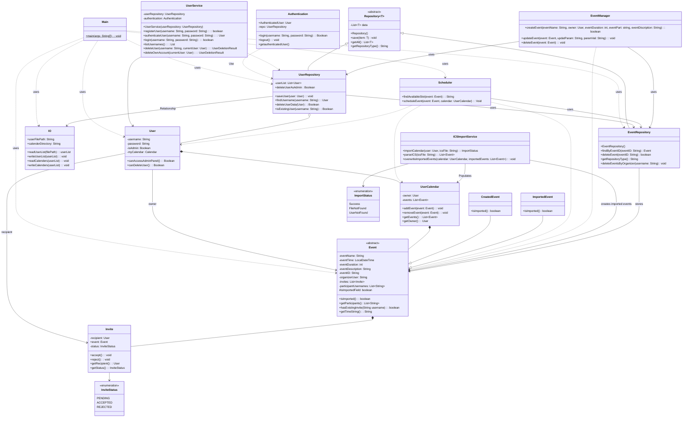

```mermaid
classDiagram
    class Authentication {
        +AuthenticatedUser: User
        -repo: UserRepository
        +login(username: String, password: String) : Boolean
        +logout() : void
        +getauthenticatedUser()
    }

    class Main {
        +main(args: String[]) : void$
    }

    class UserService {
        -userRepository: UserRepository
		-authentication: Authentication
        +UserService(userRepository: UserRepository)
		+registerUser(username: String, password: String) : : boolean
		+authenticateUser(username: String, password: String) : : User
		+login(username: String, password: String) : : boolean
		+listUsernames() : : List<String>
		+deleteUser(username: String, currentUser: User) : : UserDeletionResult
		+deleteOwnAccount(currentUser: User) : : UserDeletionResult
    }


    class Repository~T~ {
        <<abstract>>
        -List~T~ data
        +Repository()
        +save(item: T) void
        +getAll() List~T~
        +getRepositoryType() String
    }

    class EventRepository {
        +EventRepository()
        +findByEventID(eventID: String) Event
        +deleteEvent(eventID: String) boolean
        +getRepositoryType() String
        +deleteEventsByOrganizer(username: String) void
    }

    class UserRepository {
        -userList: List~User~
        +saveUser(user: User) : void
        +findUsername(username: String) : User
        +deleteUserData(User) : Boolean
        +deleteUserAsAdmin : Boolean
        +isExistingUser(username: String) : Boolean
    }

    class IO {
        +userFilePath: String
        +calenderDirectory: String
        +readUserList(filePath): userList
        +writeUserList(userList): void
        +readCalenders(userList): void
        +writeCalenders(userList): void
    }

    class User {
        -username: String
        -password: String
        -isAdmin: Boolean
        -myCalendar: Calendar
        +canAccessAdminPanel() : Boolean
        +canDeleteUser() : Boolean

    }

    class Scheduler {
        +findAvailableSlot(event: Event) : String
        +scheduleEvent(event: Event, calendar: UserCalendar) : Void
    }

    class EventManager {
        +createEvent(eventName: String, owner: User, eventDuration: int, eventPart: string, eventDiscription: String) : boolean
        +updateEvent(event: Event, updatParam: String, paramVal: String) : void
        +deleteEvent(event: Event) : void
    }

    class UserCalendar {
        -owner: User
        -events: List~Event~
        +addEvent(event: Event) : void
        +removeEvent(event: Event) : void
        +getEvents() : List~Event~
        +getOwner() : User
    }

    class ICSImportService {
        +importCalendar(user: User, icsFile: String) : ImportStatus
        +parseICS(icsFile: String) : List~Event~
        +overwriteImportedEvents(calendar: UserCalendar, importedEvents: List~Event~) : void
    }

    class Event {
         <<abstract>>
        -eventName: String
        -eventTime: LocalDateTime
        -eventDuration: int
        -eventDescription: String
        -eventID: String 
        -organizerUser: String
        -invites: List~Invite~
        -participantUsernames: List~String~
        #isImportedField: boolean
        
        +isImported(): boolean
        +getParticipants() List~String~
        +hasExistingInvite(String username): boolean
        +getTimeString(): String
    }
    
    class CreatedEvent {
         +isImported() boolean
    }
    
    class ImportedEvent {
        +isImported() boolean
    }

    class Invite {
        -recipient: User
        +event: Event
        -status: InviteStatus
        +accept() : void
        +reject() : void
        +getRecipient() : User
        +getStatus() : InviteStatus
    }

    class ImportStatus {
        <<enumeration>>
        Success
        FileNotFound
        UserNotFound
    }

    class InviteStatus {
        <<enumeration>>
        PENDING
        ACCEPTED
        REJECTED
    }

    %% Relationships
    Main ..> IO : uses
    Main ..> UserRepository : uses
    Main ..> EventRepository : uses
    Main ..> Scheduler : uses
    Main ..> User : uses
    Main ..> Event : uses
    Authentication ..> UserRepository : Use
    UserService ..> UserRepository
    UserService --> User
    UserRepository o-- User
    UserRepository --> IO : Relationship
    User *-- UserCalendar
    User --> Event : owner
    User --> Invite : recipient
    UserCalendar *-- Event
    Event *-- Invite
    CreatedEvent --|> Event
    ImportedEvent --|> Event
    Scheduler ..> User
    Scheduler ..> UserCalendar
    Scheduler ..> Event
    EventManager ..> Event
    ICSImportService --> UserCalendar : Populates
    ICSImportService --> Event : creates imported events
    ICSImportService --> ImportStatus
    Invite --> InviteStatus
    Repository <|-- EventRepository
    Repository <|-- UserRepository
    EventRepository --> Event : stores
    UserRepository --> EventRepository : uses
    Scheduler --> EventRepository : uses
    EventManager --> EventRepository : uses
    EventManager --> UserRepository : uses
```