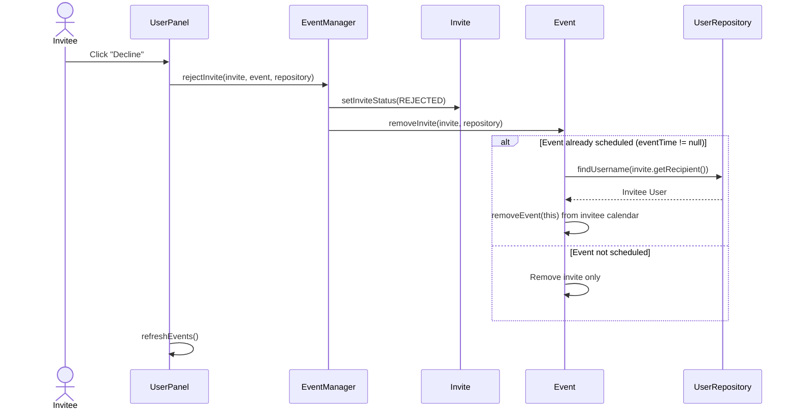

```mermaid
sequenceDiagram
    actor U as Invitee
    participant UP as UserPanel
    participant EM as EventManager
    participant I as Invite
    participant E as Event
    participant UR as UserRepository

    U->>UP: Click "Decline"
    UP->>EM: rejectInvite(invite, event, repository)
    EM->>I: setInviteStatus(REJECTED)
    EM->>E: removeInvite(invite, repository)

    alt Event already scheduled (eventTime != null)
        E->>UR: findUsername(invite.getRecipient())
        UR-->>E: Invitee User
        E->>E: removeEvent(this) from invitee calendar
    else Event not scheduled
        E->>E: Remove invite only
    end

    UP->>UP: refreshEvents()
```
