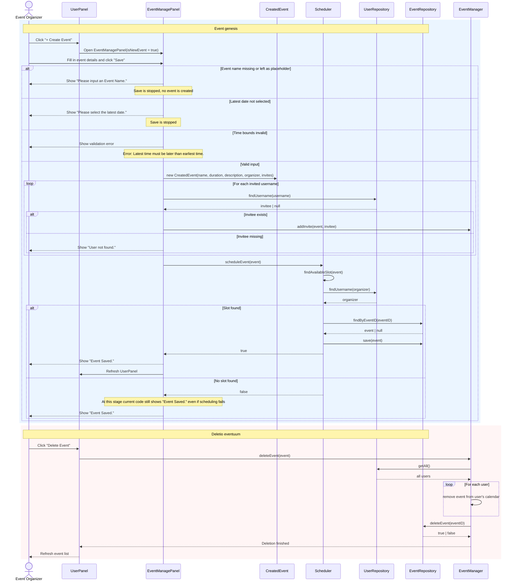

```mermaid
sequenceDiagram
    actor O as Event Organizer
    participant UP as UserPanel
    participant EMP as EventManagePanel
    participant CE as CreatedEvent
    participant S as Scheduler
    participant UR as UserRepository
    participant ER as EventRepository
    participant EM as EventManager

    rect rgb(235, 245, 255)
        Note over O,ER: Event genesis
        O->>UP: Click "+ Create Event"
        UP->>EMP: Open EventManagePanel(isNewEvent = true)

        O->>EMP: Fill in event details and click "Save"
        alt Event name missing or left as placeholder
            EMP-->>O: Show "Please input an Event Name."
            Note over EMP: Save is stopped, no event is created
        else Latest date not selected
            EMP-->>O: Show "Please select the latest date."
            Note over EMP: Save is stopped
        else Time bounds invalid
            EMP-->>O: Show validation error
            Note over EMP: Error: Latest time must be later than earliest time.
        else Valid input
            EMP->>CE: new CreatedEvent(name, duration, description, organizer, invites)
            loop For each invited username
                EMP->>UR: findUsername(username)
                UR-->>EMP: invitee | null
                alt Invitee exists
                    EMP->>EM: addInvite(event, invitee)
                else Invitee missing
                    EMP-->>O: Show "User not found."
                end
            end
            EMP->>S: scheduleEvent(event)
            S->>S: findAvailableSlot(event)
            S->>UR: findUsername(organizer)
            UR-->>S: organizer
            alt Slot found
                S->>ER: findByEventID(eventID)
                ER-->>S: event | null
                S->>ER: save(event)
                S-->>EMP: true
                EMP-->>O: Show "Event Saved."
                EMP->>UP: Refresh UserPanel
            else No slot found
                S-->>EMP: false
                Note over EMP: At this stage current code still shows "Event Saved." even if scheduling fails
                EMP-->>O: Show "Event Saved."
            end
        end
    end

    rect rgb(255, 245, 245)
        Note over O,ER: Deletio eventuum
        O->>UP: Click "Delete Event"
        UP->>EM: deleteEvent(event)
        EM->>UR: getAll()
        UR-->>EM: all users
        loop For each user
            EM->>EM: remove event from user's calendar
        end
        EM->>ER: deleteEvent(eventID)
        ER-->>EM: true | false
        EM-->>UP: Deletion finished
        UP-->>O: Refresh event list
    end
```
