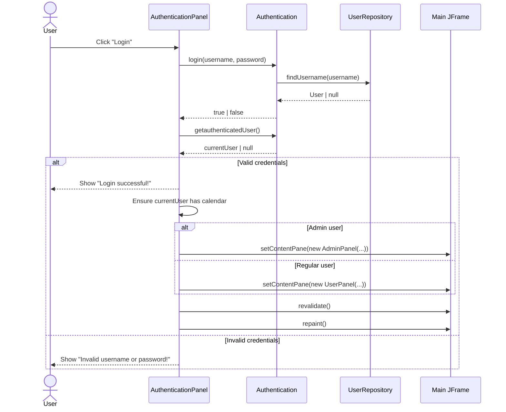

```mermaid
sequenceDiagram
    actor U as User
    participant AP as AuthenticationPanel
    participant A as Authentication
    participant UR as UserRepository
    participant F as Main JFrame

    U->>AP: Click "Login"
    AP->>A: login(username, password)
    A->>UR: findUsername(username)
    UR-->>A: User | null
    A-->>AP: true | false
    AP->>A: getauthenticatedUser()
    A-->>AP: currentUser | null

    alt Valid credentials
        AP-->>U: Show "Login successful!"
        AP->>AP: Ensure currentUser has calendar
        alt Admin user
            AP->>F: setContentPane(new AdminPanel(...))
        else Regular user
            AP->>F: setContentPane(new UserPanel(...))
        end
        AP->>F: revalidate()
        AP->>F: repaint()
    else Invalid credentials
        AP-->>U: Show "Invalid username or password!"
    end
```
