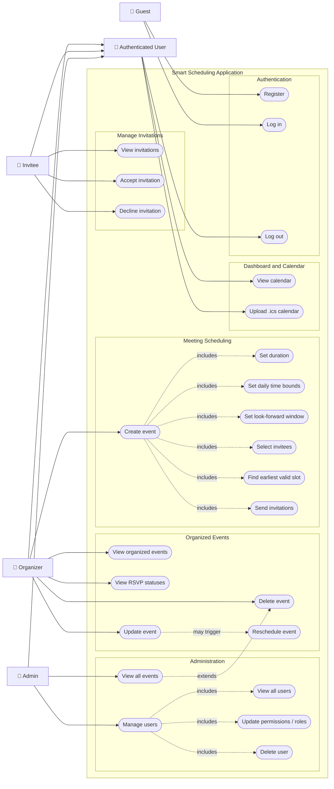

```mermaid
flowchart LR
    %% Actors
    Admin[👤 Admin]
    Invitee[👤 Invitee]
    Organizer[👤 Organizer]
    AuthUser[👤 Authenticated User]
    Guest[👤 Guest]

    %% Actor Inheritance / Generalization
    Admin ---> AuthUser
    Invitee ---> AuthUser
    Organizer ---> AuthUser

    subgraph SystemBoundary [Smart Scheduling Application]

        subgraph Administration [Administration]
            UC_ManageUsers([Manage users])
            UC_ViewAllUsers([View all users])
            UC_UpdatePerms([Update permissions / roles])
            UC_DeleteUser([Delete user])
            UC_ViewAllEvents([View all events])

            UC_ManageUsers -.->|includes| UC_ViewAllUsers
            UC_ManageUsers -.->|includes| UC_UpdatePerms
            UC_ManageUsers -.->|includes| UC_DeleteUser
        end

        subgraph Manage Invitations [Manage Invitations]
            UC_ViewInvites([View invitations])
            UC_AcceptInvite([Accept invitation])
            UC_DeclineInvite([Decline invitation])
        end

        subgraph OrganizedEvents [Organized Events]
            UC_ViewOrgEvents([View organized events])
            UC_ViewRSVP([View RSVP statuses])
            UC_DeleteEvent([Delete event])
            UC_UpdateEvent([Update event])
            UC_RescheduleEvent([Reschedule event])

            UC_UpdateEvent -.->|may trigger| UC_RescheduleEvent
        end

        %% Cross-Group Extension
        UC_ViewAllEvents -.->|extends| UC_DeleteEvent

        subgraph MeetingScheduling [Meeting Scheduling]
            UC_CreateEvent([Create event])
            UC_SetDuration([Set duration])
            UC_SetDailyBounds([Set daily time bounds])
            UC_SetLookFwd([Set look-forward window])
            UC_SelectInvitees([Select invitees])
            UC_FindSlot([Find earliest valid slot])
            UC_SendInvites([Send invitations])

            UC_CreateEvent -.->|includes| UC_SetDuration
            UC_CreateEvent -.->|includes| UC_SetDailyBounds
            UC_CreateEvent -.->|includes| UC_SetLookFwd
            UC_CreateEvent -.->|includes| UC_SelectInvitees
            UC_CreateEvent -.->|includes| UC_FindSlot
            UC_CreateEvent -.->|includes| UC_SendInvites
        end

        subgraph DashboardCalendar [Dashboard and Calendar]
            UC_ViewCalendar([View calendar])
            UC_UploadICS([Upload .ics calendar])
        end

        subgraph Auth [Authentication]
            UC_Register([Register])
            UC_LogIn([Log in])
            UC_LogOut([Log out])
        end

    end

    %% Actor to Use Case Relationships
    Admin --> UC_ManageUsers
    Admin --> UC_ViewAllEvents

    Invitee --> UC_ViewInvites
    Invitee --> UC_AcceptInvite
    Invitee --> UC_DeclineInvite

    Organizer --> UC_ViewOrgEvents
    Organizer --> UC_ViewRSVP
    Organizer --> UC_DeleteEvent
    Organizer --> UC_UpdateEvent
    Organizer --> UC_CreateEvent

    AuthUser --> UC_ViewCalendar
    AuthUser --> UC_UploadICS
    AuthUser --> UC_LogOut

    Guest --> UC_Register
    Guest --> UC_LogIn
```