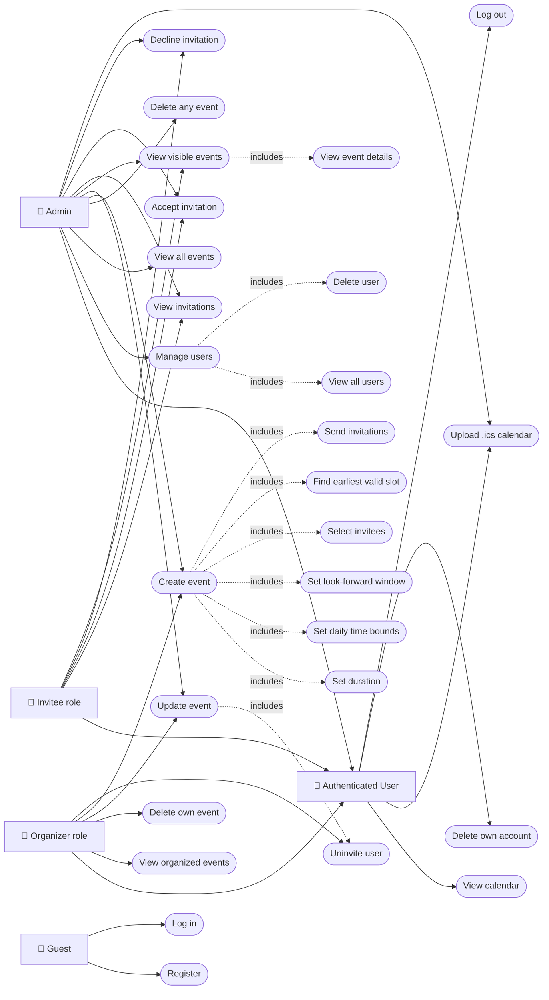

```mermaid
flowchart LR
    %% Actors
    Admin[👤 Admin]
    AuthUser[👤 Authenticated User]
    Organizer[👤 Organizer role]
    Invitee[👤 Invitee role]
    Guest[👤 Guest]

    %% Actor Inheritance / Generalization
    Admin ---> AuthUser
    Organizer ---> AuthUser
    Invitee ---> AuthUser

    UC_ManageUsers([Manage users])
    UC_ViewAllUsers([View all users])
    UC_DeleteUser([Delete user])
    UC_ViewAllEvents([View all events])
    UC_DeleteAnyEvent([Delete any event])

    UC_ManageUsers -.->|includes| UC_ViewAllUsers
    UC_ManageUsers -.->|includes| UC_DeleteUser

    UC_ViewInvites([View invitations])
    UC_AcceptInvite([Accept invitation])
    UC_DeclineInvite([Decline invitation])

    UC_ViewVisibleEvents([View visible events])
    UC_ViewOrgEvents([View organized events])
    UC_DeleteOwnEvent([Delete own event])
    UC_UpdateEvent([Update event])
    UC_UninviteUser([Uninvite user])
    UC_ViewEventDetails([View event details])

    UC_UpdateEvent -.->|includes| UC_UninviteUser

    UC_CreateEvent([Create event])
    UC_SetDuration([Set duration])
    UC_SetDailyBounds([Set daily time bounds])
    UC_SetLookFwd([Set look-forward window])
    UC_SelectInvitees([Select invitees])
    UC_FindSlot([Find earliest valid slot])
    UC_SendInvites([Send invitations])

    UC_CreateEvent -.->|includes| UC_SetDuration
    UC_CreateEvent -.->|includes| UC_SetDailyBounds
    UC_CreateEvent -.->|includes| UC_SetLookFwd
    UC_CreateEvent -.->|includes| UC_SelectInvitees
    UC_CreateEvent -.->|includes| UC_FindSlot
    UC_CreateEvent -.->|includes| UC_SendInvites
    UC_ViewVisibleEvents -.->|includes| UC_ViewEventDetails

    UC_ViewCalendar([View calendar])
    UC_UploadICS([Upload .ics calendar])
    UC_DeleteOwnAccount([Delete own account])

    UC_Register([Register])
    UC_LogIn([Log in])
    UC_LogOut([Log out])

    %% Actor to Use Case Relationships
    Admin --> UC_ManageUsers
    Admin --> UC_ViewAllEvents
    Admin --> UC_DeleteAnyEvent
    Admin --> UC_CreateEvent
    Admin --> UC_UpdateEvent
    Admin --> UC_ViewVisibleEvents
    Admin --> UC_ViewInvites
    Admin --> UC_AcceptInvite
    Admin --> UC_DeclineInvite
    Admin --> UC_UploadICS

    Invitee --> UC_ViewInvites
    Invitee --> UC_AcceptInvite
    Invitee --> UC_DeclineInvite
    Invitee --> UC_ViewVisibleEvents

    Organizer --> UC_ViewOrgEvents
    Organizer --> UC_DeleteOwnEvent
    Organizer --> UC_UpdateEvent
    Organizer --> UC_CreateEvent
    Organizer --> UC_UninviteUser

    AuthUser --> UC_ViewCalendar
    AuthUser --> UC_UploadICS
    AuthUser --> UC_DeleteOwnAccount
    AuthUser --> UC_LogOut

    Guest --> UC_Register
    Guest --> UC_LogIn

```
